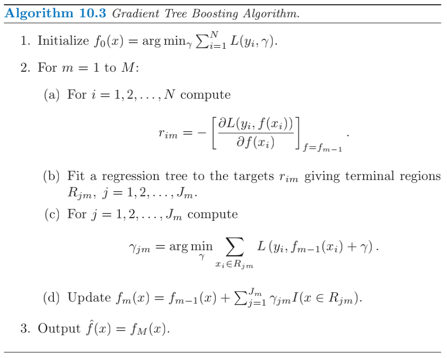
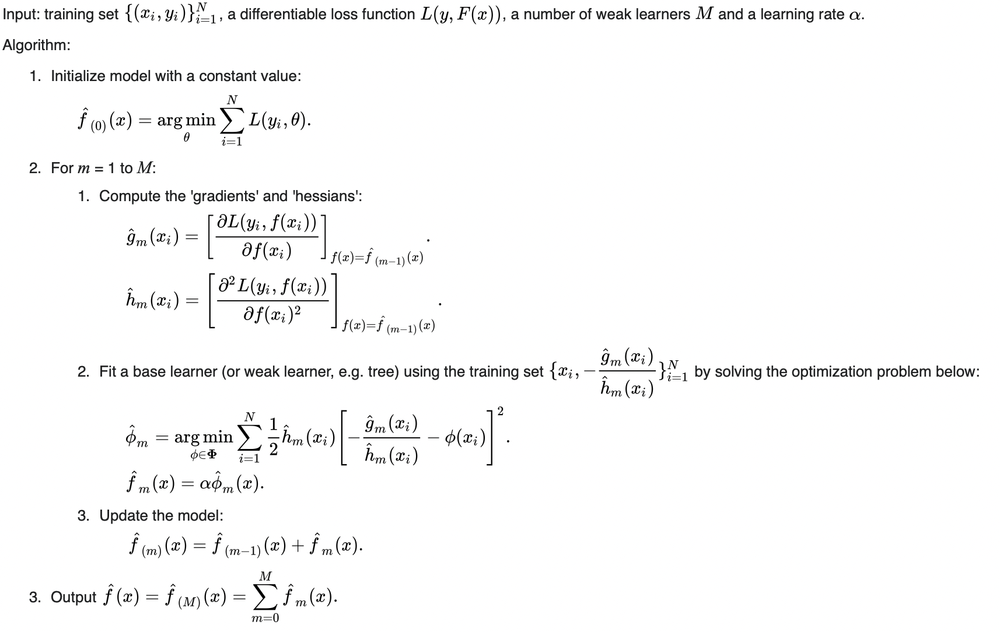
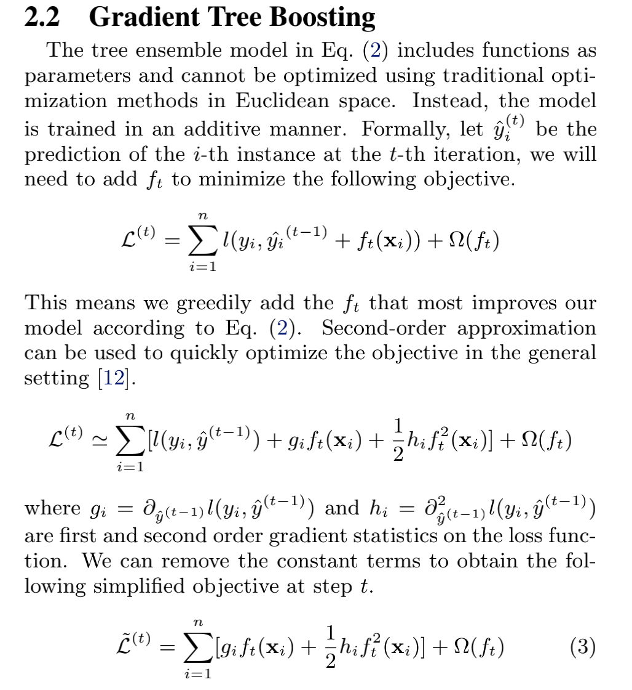
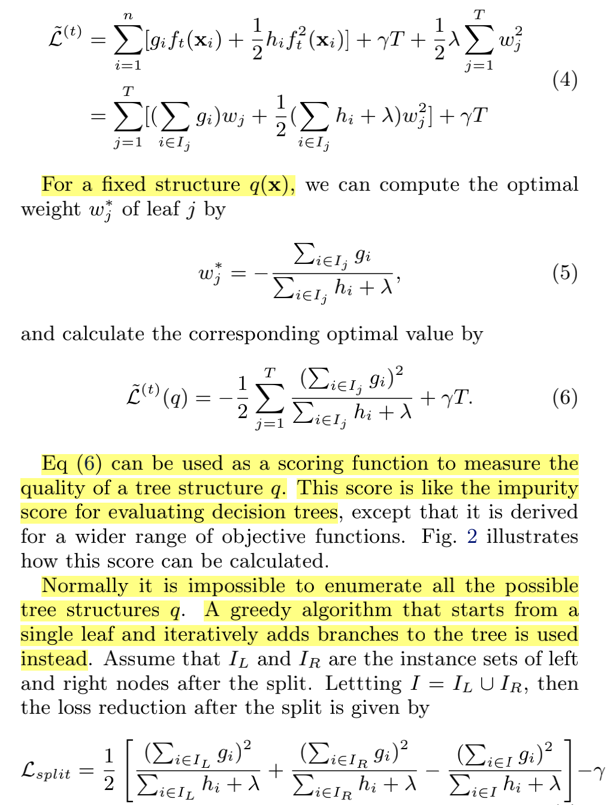
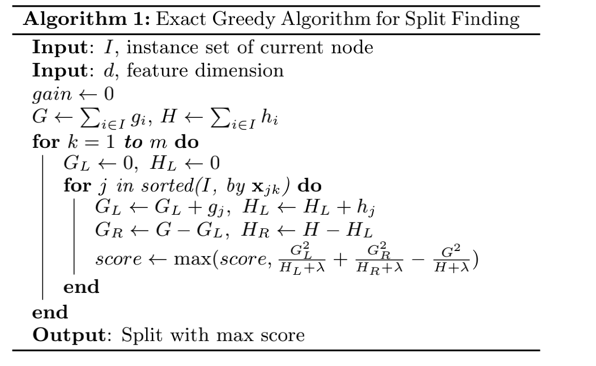
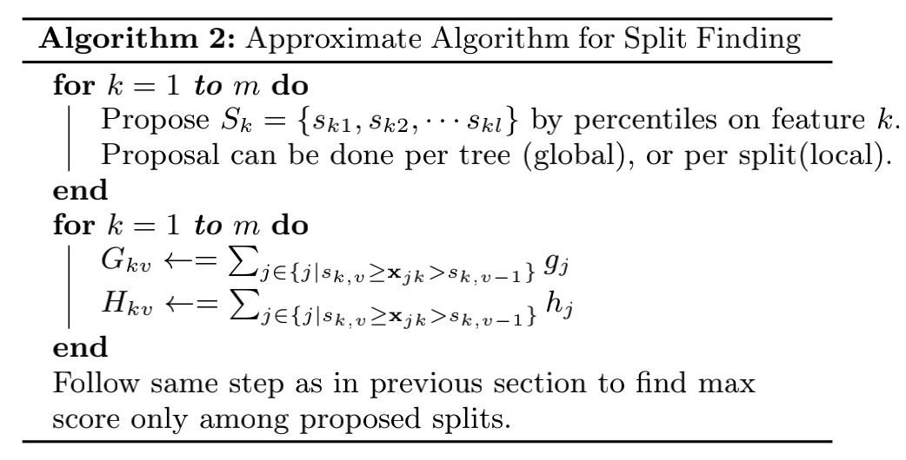
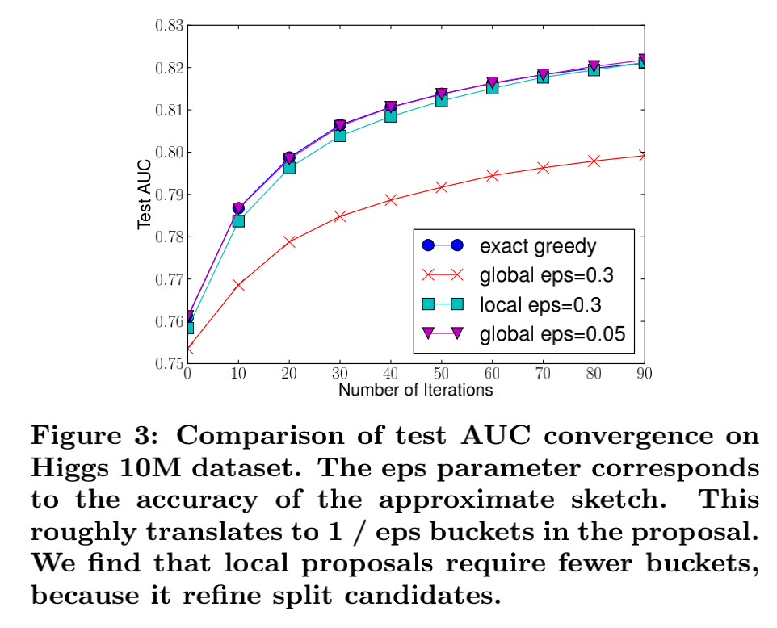
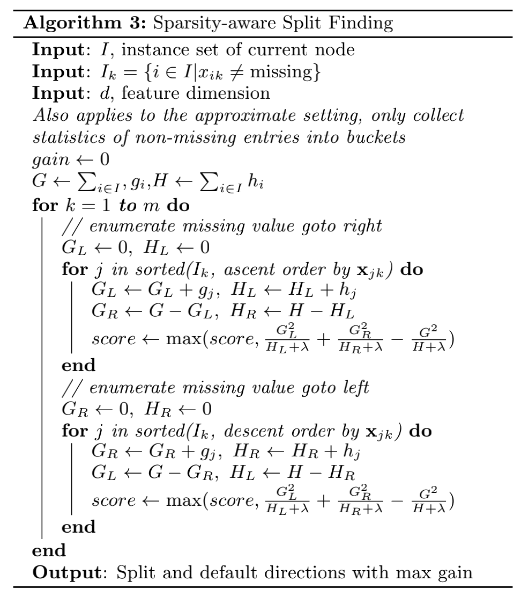

# Boosting notes

## Adaboost

Just for Binary Classification with Exp loss

## Boosting Tree

Regression with MSE loss, which can be implemented by fitting the residual

## Gradient Boosting

In many **supervised learning** problems there is an output variable $y$ and a vector of input variables $x$, related to each other with some probabilistic distribution. The goal is to find some function $\hat{F}(x)$ that best approximates the output variable from the values of input variables. This is formalized by introducing some **loss function** $L(y, F(x))$ and minimizing it:

$$\hat{F} = \underset{F}{\arg\min} \, \mathbb{E}_{x,y}[L(y, F(x))]$$.

The gradient boosting method assumes a real-valued $y$ and seeks an approximation  $\hat{F}(x)$ in the form of a weighted sum of functions $h_i (x)$ from some class $\mathcal{H}$, called base or **weak learners**:

$$\hat{F}(x) = \sum_{i=1}^M \gamma_i h_i(x) + \mbox{const}$$.

We are usually given a training set $ (x_1,y_1), \dots , (x_n,y_n) \}$ of known sample values of $x$ and corresponding values of $y$. In accordance with the **empirical risk minimization** principle, the method tries to find an approximation $\hat{F}(x)$ that minimizes the average value of the loss function on the training set, i.e., minimizes the empirical risk. It does so by starting with a model, consisting of a constant function$F_0(x)$ and incrementally expands it in a **Greedy algorithm** fashion:

$$F_0(x) = \underset{\gamma}{\arg\min} {\sum_{i=1}^n {L(y_i, \gamma)}}$$,
$$F_m(x) = F_{m-1}(x) + \underset{h_m \in \mathcal{H}}{\operatorname{arg\,min}} \left[{\sum_{i=1}^n {L(y_i, F_{m-1}(x_i) + h_m(x_i))}}\right]$$,

where $ h_m \in \mathcal{H} $ is a base learner function.

Unfortunately, choosing the best function $h$ at each step for an arbitrary loss function $L$ is a computationally infeasible optimization problem in general. Therefore, we  restrict our approach to a simplified version of the problem.

The idea is to apply a **steepest descent** step to this minimization problem (functional gradient descent). 

The basic idea behind the steepest descent is to find a local minimum of the loss function by iterating on the $F_m(x)$. In fact, it can be proven that the maximum-descent direction (strongest negative derivative) of the loss function to the local minimum along the $F_m(x)$ is the function itself subtracted by the loss function gradient itself. Hence:

$$F_m(x) = F_{m-1}(x) - \gamma \sum_{i=1}^n {\nabla_{F_{m-1}} L(y_i, F_{m-1}(x_i))}$$

Where $\gamma > 0$. This implies: $L(y_i, F_{m}(x_i)) \le L(y_i, F_{m-1}(x_i))$.

Furthermore, we can optimize $\gamma$ by finding the $\gamma$ value for which the Loss Function has a minimum:

$\gamma_m = \underset{\gamma}{\arg\min} {\sum_{i=1}^n {L\left(y_i, F_{m}) \right)}} = \underset{\gamma}{\arg\min} {\sum_{i=1}^n {L\left(y_i, F_{m-1}(x_i) -
    \gamma \nabla_{F_{m-1}} L(y_i, F_{m-1}(x_i)) \right)}},$

If we considered the continuous case, i.e. where $\mathcal{H} $ is the set of arbitrary differentiable functions on $ \R$, we would update the model in accordance with the following equations,
F$$_m(x) = F_{m-1}(x) - \gamma_m \sum_{i=1}^n {\nabla_{F_{m-1}} L(y_i, F_{m-1}(x_i))}$$

$$\gamma_m = \underset{\gamma}{\arg\min} {\sum_{i=1}^n {L\left(y_i, F_{m-1}(x_i) -
    \gamma \nabla_{F_{m-1}} L(y_i, F_{m-1}(x_i)) \right)}},$$
where the derivatives are taken with respect to the functions $ F_i$ for $ i \in \{ 1,..,m \}$, and $\gamma_m$ is the **step length**.  In the discrete case however, i.e. when the set $\mathcal{H}$ is finite, we choose the candidate function $h$ closest to the gradient of $L$ for which the coefficient $\gamma$ may then be calculated with the aid of **line search** on the above equations. Note that this approach is a heuristic and therefore doesn't yield an exact solution to the given problem, but rather an approximation.
In pseudocode, the generic gradient boosting method is:

------

- Input: training set $\{(x_i, y_i)\}_{i=1}^n,$ a differentiable loss function $L(y, F(x)),$ number of iterations $M$.

* Algorithm:

  1. Initialize model with a constant value:

     $$F_0(x) = \underset{\gamma}{\arg\min} \sum_{i=1}^n L(y_i, \gamma).$$

  2. For $m$ = 1 to $M$:

     1. Compute so-called ''pseudo-residuals'':

        $$r_{im} = -\left[\frac{\partial L(y_i, F(x_i))}{\partial F(x_i)}\right]_{F(x)=F_{m-1}(x)} \quad \mbox{for } i=1,\ldots,n.$$

     2. Fit a base learner (or weak learner, e.g. tree) closed under scaling $h_m(x)$ to pseudo-residuals, i.e. train it using the training set $\{(x_i, r_{im})\}_{i=1}^n$.

     3. Compute multiplier $\gamma_m$ by solving the following one-dimensional optimization problem:

        $$\gamma_m = \underset{\gamma}{\operatorname{arg\,min}} \sum_{i=1}^n L\left(y_i, F_{m-1}(x_i) + \gamma h_m(x_i)\right).$$

     4. Update the model:

        $$F_m(x) = F_{m-1}(x) + \gamma_m h_m(x).$$

  3. Output $F_M(x).$

------

## Gradient Boosting Tree

Gradient boosting is typically used with decision trees(especially CART trees) of a fixed size as base learners. For this special case, Friedman proposes a modification to gradient boosting method which improves the quality of fit of each base learner.

Generic gradient boosting at the *m*-th step would fit a decision tree $h_m(x)$ to pseudo-residuals. Let $J_{m}$ be the number of its leaves. The tree partitions the input space into $J_{m}$ disjoint regions $R_{1m},\ldots ,R_{J_{mm}}$ and predicts a constant value in each region. Using the indicator notation, the output of $h_m(x)$ for input $x$ can be written as the sum:

$$h_m(x) = \sum_{j=1}^{J_{m}} b_{jm} \mathbf {1}_{R_{jm}}(x),$$

where $b_{jm}$ is the value predicted in the region $R_{jm}$. 

Then the coefficients $b_{jm}$ are multiplied by some value $\gamma _{m}$, chosen using line search so as to minimize the loss function, and the model is updated as follows:

$$F_m(x) = F_{m-1}(x) + \gamma_m h_m(x), \quad
    \gamma_m = \underset{\gamma}{\operatorname{arg\,min}} \sum_{i=1}^n L(y_i, F_{m-1}(x_i) + \gamma h_m(x_i)).$$

Friedman proposes to modify this algorithm so that it chooses a separate optimal value $\gamma_{jm}$ for each of the tree's regions, instead of a single $\gamma_m$ from the tree-fitting procedure can be then simply discarded and the model update rule becomes:

$$     F_m(x) = F_{m-1}(x) + \sum_{j=1}^{J_{m}} \gamma_{jm} \mathbf {1}_{R_{jm}}(x), \quad
    \gamma_{jm} = \underset{\gamma}{\operatorname{arg\,min}} \sum_{x_i \in R_{jm}} L(y_i, F_{m-1}(x_i) + \gamma). $$

## Xgboost

 [XGBoost: A Scalable Tree Boosting System](http://arxiv.org/abs/1603.02754)

[GitHub - xgboost](https://github.com/dmlc/xgboost)

Scalable, Portable and Distributed Gradient Boosting (GBDT, GBRT or GBM) Library, for Python, R, Java, Scala, C++ and more. Runs on single machine, Hadoop, Spark, Dask, Flink and DataFlow

### wiki Definition

XGBoost works as Newton Raphson in function space unlike gradient boosting that works as gradient descent in function space, a second order taylor's approximation is used in the loss function to make the connection to Newton Raphson method.

A generic unregularized xgboost algorithm is:

### Gradient Boosting Formula Derivation

Note: $g_i,h_i$ is constant for step $t$, only need to be calculated once.

Note: $L_{split}$ is calculated for a certain split node with controlling others unchanged, and can be used to evaluate the split candidates.

### Further Regularization Techs

-  Shrinkage 
  - introduced by Friedman (Stochastic Gradient Boosting)
- Column Subsampling
  - used in RandomForest

### SPLIT FINDING ALGORITHMS

- Basic Exact Greedy Algorithm

  -  enumerates over all the possible splits on all the features.
    - 从深度为 0 的树开始，对每个叶节点枚举所有的可用特征；
    - 针对每个特征，**把属于该节点的训练样本根据该特征值进行升序排列**，通过线性扫描的方式来决定该特征的最佳分裂点，并记录该特征的分裂收益；
    - 选择收益最大的特征作为分裂特征，用该特征的最佳分裂点作为分裂位置，在该节点上分裂出左右两个新的叶节点，并为每个新节点关联对应的样本集
    - 回到第 1 步，递归执行到满足特定条件为止
  - In order to do so efficiently, the algorithm must first sort the data according to feature values and visit the data in sorted order to accumulate the gradient statistics for the structure score.
    - 为了更高效地枚举所有分割方案.(比如样本在某特征为6,3,7,8,2，那么我们分割点取x，需要对每个样本进行判断是否大于x，然后决定分配到左节点还是右节点。而排序后，样本特征为2,3,6,7,8,则直接知道，x左边的分配到左结点，右边的分配到右节点。这样只需要从左到右一遍线性扫描即可。挨个进入退出)

  

- Approximate Algorithm

  - the algorithm fifirst proposes candidate splitting points according to percentiles of feature

    distribution.

  - Global：学习每棵树前就提出候选切分点，并在每次分裂时都采用这种分割；

    Local：每次分裂前将重新提出候选切分点。

  - Global策略计算步骤更少，而因为节点划分后没有重新调整(refine)候选点，因此需要更多的候选点。

  - Local策略因为每次分割后对候选点进行调整，所以可能更加适合深一点的树。

  - Local 策略需要更多的计算步骤，而 Global 策略因为节点没有划分所以需要更多的候选点。

  

  

  Note: The **eps** parameter corresponds to the accuracy of the approximate sketch.

- Weighted Quantile Sketch

  - propose candidate split points
  - 对于大型数据集，找到满足条件的候选分割是非常重要的。 当每个实例具有相等的权重时，称为quantile sketch的现有算法解决了该问题。 但是，对于加权数据集来说，不存在现有的quantile sketch。 因此，大多数现有的近似算法要么对随机数据子集进行排序（但是可能会出错），要么使用没有理论保证的启发式算法进行排序。

- Sparsity-aware Split Finding

  - 数据缺失的处理：本身在节点分类时不考虑特征缺失样本的数值。缺失值数据会被分到左子树和右子树分别计算损失，选择增益大的划分方式。如果训练中没有数据损失，预测时出现了数据损失，那么默认被分类到右子树。
  - 提出的算法将不存在的值视为缺失值并且学习处理缺失值的最佳方向。

  

### Other System Designs

- Column Block for Parallel Learning
- Cache-aware Access
- Blocks for Out-of-core Computation

## LGBM

[LightGBM: A Highly Efficient Gradient Boosting Decision Tree](https://www.microsoft.com/en-us/research/publication/lightgbm-a-highly-efficient-gradient-boosting-decision-tree/)

[GitHub - microsoft/LightGBM](https://github.com/microsoft/LightGBM)

[LightGBM’s documentation](https://lightgbm.readthedocs.io/en/latest/index.html)

A fast, distributed, high performance gradient boosting (GBT, GBDT, GBRT, GBM or MART) framework based on decision tree algorithms, used for ranking, classification and many other machine learning tasks.

Forked from https://blog.csdn.net/weixin_44023658/article/details/106732861.

决策树学习的两种方法：

leaf-wise learning：a. choose a leaf with max delta loss. b. split it into 2 leaves.即不断寻找分裂后收益最大的叶子节点，将其分裂成两个节点，从而生长决策树。(生长过程是顺序的，不方便加速)

level-wise learning: split all leaves into 2 leaves. 按层生长，不需要每次去挑选节点，在每一个level中各个节点的分裂可以并行完成。（但是会产生很多没有必要的分裂，有更多的计算代价。）

LightGBM的改进：

**直方图算法**

xgboost采用预排序的方法，计算过程中则是按照feature value的排序，逐个数据样本计算当前feature value的分裂收益。这样能够精确找到最佳分裂点。

lightGBM采用直方图算法，将连续的特征离散化为 k 个离散特征，同时构造一个宽度为 k 的直方图用于统计信息（含有 k 个 bin）。利用直方图算法我们无需遍历数据，只需要遍历 k 个 bin 即可找到最佳分裂点。

使用直方图优化的好处：

- 降低内存的使用。Xgboost按照feature value对数据排序，用32位整型去存储排序后的索引值，32位整型去存储特征值，而lightgbm只需要8位去存储分桶后的bin value，内存下降了1/8.
- 降低计算代价。计算特征分裂增益时，XGBoost 需要遍历一次数据找到最佳分裂点，而 LightGBM 只需要遍历一次 k 次，直接将时间复杂度从 O(#data * #feature) 降低到 O(k * #feature) ，而我们知道 #data >> k 。

**带深度限制的leaf-wise算法**

XGBoost 采用 Level-wise 的增长策略，方便并行计算每一层的分裂节点，提高了训练速度，但同时也因为节点增益过小增加了很多不必要的分裂；LightGBM 采用 Leaf-wise 的增长策略减少了计算量，配合最大深度的限制防止过拟合，由于每次都需要计算增益最大的节点，所以无法并行分裂。

**直方图的差加速**

在构建叶节点的直方图时，我们还可以通过父节点的直方图与相邻叶节点的直方图相减的方式构建，从而减少了一半的计算量。在实际操作过程中，我们还可以先计算直方图小的叶子节点，然后利用直方图作差来获得直方图大的叶子节点。可以达到2倍加速的效果。

**提升cache命中率**

xgboost对cache优化不够好。在预排序后，特征对梯度的访问是一种随机访问，并且不同的特征访问的顺序不一样，无法对cache进行优化。同时，在每一层长树的时候，需要随机访问一个行索引到叶子索引的数组，并且不同特征访问的顺序也不一样，也会造成较大的cache miss。

基于直方图的算法简单的提高cache命中率。

所有的feature采用相同方法访问梯度(区别于不同特征通过不同的索引获得梯度)，只需要对梯度进行一次重新排序，所有特征能够连续地访问梯度。不需要使用行索引到叶子索引的数组。

数据量很大的时候，相对于随机访问，顺序访问能够提升速度4倍以上。这个速度的差异基本上是由cache miss所带来的。

**直接支持类别特征作为输入**

经过实验，直接使用类别特征比one-hot特征速度快8倍以上。

**支持并行**

特征并行

传统的特征并行算法在于对数据进行垂直划分，然后使用不同机器找到不同特征的最优分裂点，基于通信整合得到最佳划分点，然后基于通信告知其他机器划分结果。传统的特征并行方法有个很大的缺点：需要告知每台机器最终划分结果，增加了额外的复杂度（因为对数据进行垂直划分，每台机器所含数据不同，划分结果需要通过通信告知）。

LightGBM 则不进行数据垂直划分，每台机器都有训练集完整数据，在得到最佳划分方案后可在本地执行划分而减少了不必要的通信。传统的特征并行算法在于对数据进行垂直划分，然后使用不同机器找到不同特征的最优分裂点，基于通信整合得到最佳划分点，然后基于通信告知其他机器划分结果。传统的特征并行方法有个很大的缺点：需要告知每台机器最终划分结果，增加了额外的复杂度（因为对数据进行垂直划分，每台机器所含数据不同，划分结果需要通过通信告知）。

LightGBM 则不进行数据垂直划分，每台机器都有训练集完整数据，在得到最佳划分方案后可在本地执行划分而减少了不必要的通信。

数据并行

传统的数据并行策略主要为水平划分数据，然后本地构建直方图并整合成全局直方图，最后在全局直方图中找出最佳划分点。

这种数据划分有一个很大的缺点：通讯开销过大。如果使用点对点通信，一台机器的通讯开销大约为 O(#machine * #feature *#bin ) ；如果使用集成的通信，则通讯开销为 O(2 * #feature *#bin ) 。

LightGBM 采用分散规约（Reduce scatter）的方式将直方图整合的任务分摊到不同机器上，从而降低通信代价，并通过直方图做差进一步降低不同机器间的通信。

投票并行

针对数据量特别大特征也特别多的情况下，可以采用投票并行。投票并行主要针对数据并行时数据合并的通信代价比较大的瓶颈进行优化，其通过投票的方式只合并部分特征的直方图从而达到降低通信量的目的。大致步骤为两步：

1. 本地找出 Top K 特征，并基于投票筛选出可能是最优分割点的特征；
2. 合并时只合并每个机器选出来的特征。
